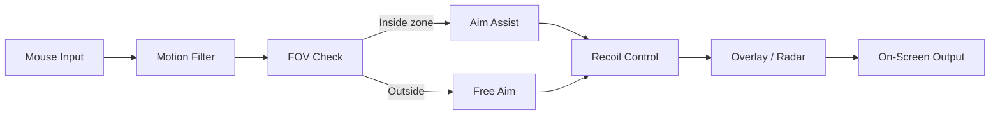

---

# Marvel Aim Enchancer bot for Rivals

Tired of missing shots and losing fights in *Rivals*? **Marvel Aim Enchancer bot** makes aiming smooth, tracking steady, and awareness sharper. It’s not “magic”—it’s smart settings that keep your crosshair where it should be and highlight what matters.

> [!IMPORTANT]
> This tool is made for private servers, testing, and sandbox environments. Use responsibly and respect community rules.

---

## ⚡️ Quick Start

1. **Download & unzip** anywhere (avoid `Program Files`).
2. **Prep the system**:

   ```powershell
   # Run in PowerShell (Admin)
   bcdedit /set testsigning on
   ```

   Restart if asked.
3. **Launch the controller**:

   ```bash
   Enchancer.Controller.exe --profile=default --overlay=on
   ```
4. **Check the overlay**: run Rivals in windowed/borderless, hit `F8` — you’ll see info pop up.

---

## 👀 What It Does

* **Smart auto aim** – keeps your crosshair locked smoothly on target.
* **Custom FOV zones** – define aim behavior at close or wide ranges.
* **ESP & radar overlay** – see enemies through walls and track positions.
* **Loot filter** – highlight ammo, meds, or objectives you actually need.
* **Profiles & hot reload** – switch styles mid-game with zero lag.
* **Ultra-low latency** – reacts in under 2ms per frame.

---

## 🖥 Compatibility

| Component | Supported             | Notes                                 |
| --------- | --------------------- | ------------------------------------- |
| Windows   | 10 / 11 (x64)         | Run as admin for best results.        |
| Display   | Windowed / Borderless | Fullscreen works but can be trickier. |
| Input     | Mouse, Keyboard       | Disable in-game accel for best feel.  |
| GPU/CPU   | DX12 / Vulkan         | Integrated graphics: disable overlay. |

**Accessibility:**
Colorblind palettes included + scalable text and outline thickness.

---

## 🔧 Sample Configs

**Balanced profile:**

```json
{
  "sens_multiplier": 0.92,
  "precision_lock": { "strength": 0.46, "smoothing": 0.38, "ramp_ms": 85 },
  "fov_gates": [
    { "deg": 2.5, "weight": 1.0 },
    { "deg": 4.0, "weight": 0.55 }
  ],
  "hotkeys": { "toggle_all": "F8", "panic_off": "F12" }
}
```

**Aggressive push profile:**

```json
{
  "sens_multiplier": 1.00,
  "precision_lock": { "strength": 0.60, "smoothing": 0.22, "ramp_ms": 55 },
  "fov_gates": [
    { "deg": 1.6, "weight": 1.0 }
  ],
  "hotkeys": { "toggle_all": "F8", "panic_off": "F12" }
}
```

---

## 📈 How It Works (Simple Flow)



---

## ❓ FAQ

**Why would I need this if I’m already decent?**
— It cuts down on errors, helps you react faster, and keeps your aim consistent under pressure.

**Will it make my game lag?**
— Nope. It’s super lightweight and runs alongside Rivals without eating FPS.

**Can I run it without ESP?**
— Yes. A lot of players prefer clean visuals with only aim assist active.

**What if I need to turn it off instantly?**
— Hit `F12`. Panic-off kills all features at once.

**Are there community configs?**
— Yes. You can drop `.json` configs into the `configs\community\` folder and load them instantly.

---

## ⚡️ Final Thoughts

If you want steadier crosshair control and smoother fights, **Marvel Aim Enchancer bot for Rivals** is built to give you that extra edge. Configure it once, fine-tune your style, and enjoy more consistent wins.
